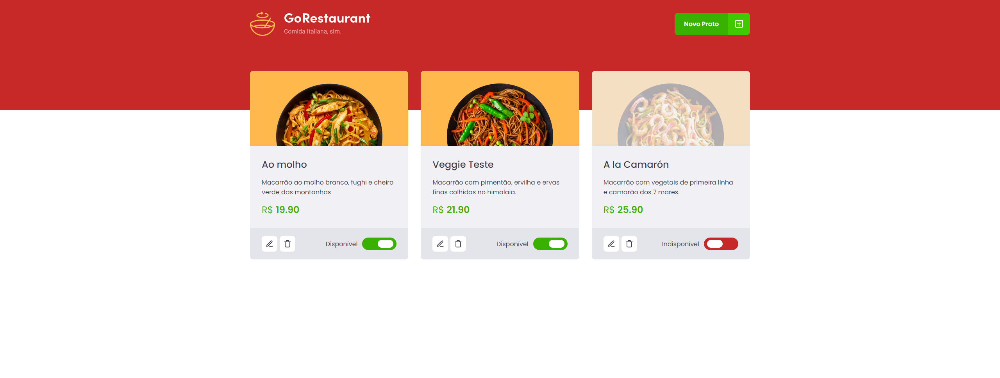

<h1 align="center">
  
</h1>


<h3 align="center">
  GoRestaurant - O restaurante que mata a sua fome de aprendizado!
</h3>


<p align="center">
  <a href="https://rocketseat.com.br">
    
  </a>
  <a href="https://www.linkedin.com/in/claudianopl/">
    
  </a>
</p>

<p align="center">
 <a href="#-sobre">Sobre</a> |
 <a href="#-requisitos">Requisitos</a> | 
 <a href="#%EF%B8%8F-como-executar">Como executar</a> | 
 <a href="#-licença">Licença</a> | 
 <a href="#-Testes">Testes</a>
</p>


## 🚀 Sobre
<p align="center">
  
</p>


Nesse desafio, o objetivo é realizar dois processos de migração: de Javascript para Typescript e de Class Components para Function Components.


Todos os componentes devem ser migrado de JavaScript para Typescript e os arquivos que possuírem componentes em classe devem ser migrados para componentes funcionais utilizando hooks.

## 📚 Requisitos
- Ter [**Git**](https://git-scm.com/) para clonar o projeto.


## ⚙️ Como executar

```bash

    # Clonar o repositório
    $ git clone https://github.com/claudianopl/GoRestaurante.git

    # Navegar para o diretório
    $ cd GoRestaurante

    # Instalar as package
    $ yarn

    # Rodar o servidor
    $ yarn server

    # Rodar o projeto
    $ yarn start
```


## 📝 Licença
Esse projeto está sob a licença MIT. Veja o arquivo [LICENSE](LICENSE.md) para mais detalhes.

---
Feito com 💜 by Claudiano Lima

<p align="right">
  
  &nbsp;&nbsp;&nbsp;&nbsp;&nbsp;&nbsp;
  
</p>
